# ocr-melody-generator

### Packages
**OMR:** numpy, tensorflow, python-opencv, matplotlib

**Music:** mido, python-rtmidi


### Current State (Jan. 16, 2025):
- Data set is currently very limited but will be increased continually (**2944** total images)
- Trained for classes: 1, 1h, 1hu, 1u, 2, 2h, 2hu, 2u, 3, 3h, 3hu, 3u, 3w, 4, 4h, 4hu, 4lu, 4u, 5, 5h, 5hu, 5l, 5lu, 5u, 6, 6l, 6lu, 6u, 7, 7l, 7lu, 7u, 7w, B, D, L, S


- Improved segmentation results for connected underlines
- Added CLI option to delete unwanted lines. Useful when lines that are not jianpu are detected (i.e., words)

### Training & Testing:
- To train, run ``` python train.py ```. Takes data from ``` data ``` file (not included)
- To test, run ``` python test.py ```. Tests data from ``` test ``` file (sample included)
- The current model is [jianpu.model.keras](jianpu.model.keras) 
- Lower epochs with sufficient data set size

### Generating
- run ``` python generate.py ```.
- A new window displaying the segmentation results will appear
- You must close the window to continue (press 0 or esc on mac)
- If any unwanted lines are detected, enter the line number to be removed in the command line
- The window will reappear with the line removed. Repeat if more lines need to be removed
- Once all unwanted lines are removed, hit ENTER. This will automatically play the generated melody if your machine has a MIDI port
- A .mid file for the melody will be generated in /output_midi 

### Example Symbol Table
|Class ID| 1  | 1h | 1u | 2  | 3  | 5  | 5l | 5u | 6  | 6lu| B  | D  | L  |
|----|----|----|----|----|----|----|----|----|----|----|----|----|----|
| Symbol ||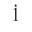|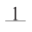|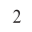|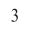|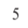|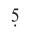|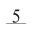|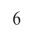|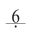|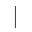|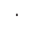|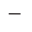|

**Semantics**:

l - lower octave\
h - higher octave\
u - underlined\
w - double underlined\
B - bar\
D - dot\
L - line (dash)
