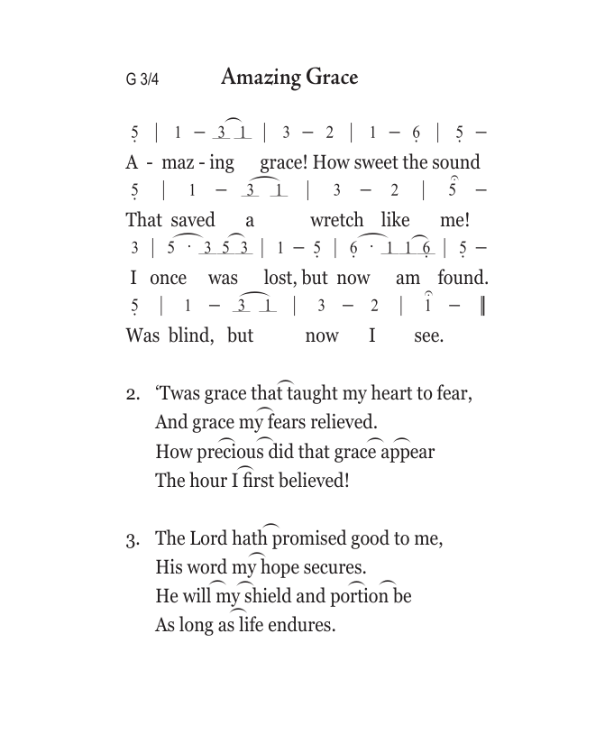
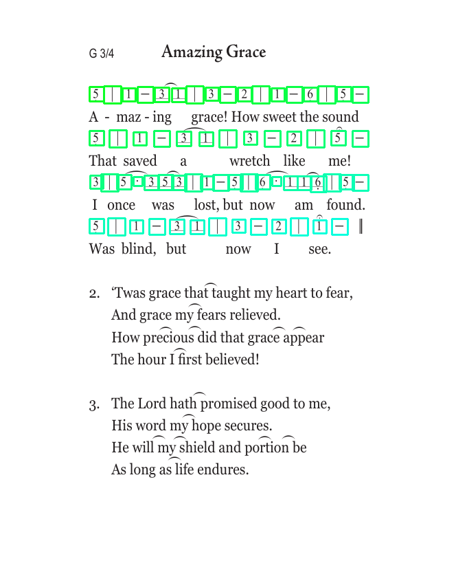

# An Example

|Provided Image|Detected Jianpu|
|--------------|--------------|
|||

Output Class ID string: 5lB1L3u1uB3L2B1L6lB5lL5lB1L3u1uB3L2B5L3B5D3u5u3uB1L5lB6lD1u1u6luB5lL5lB1L3u1uB3L2B1

Output MIDI file: [MIDI file](song.mid)